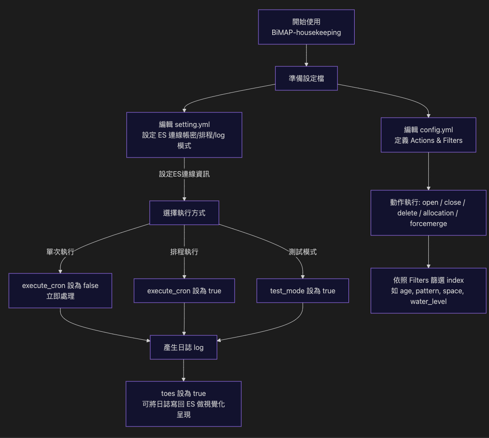

# BiMAP-housekeeping 使用手冊

> **最後更新**: 2026-02-07

> 📚 **技術文件已整理至 [`docs/`](./docs/) 目錄**  
> 包含架構文件、優化清單、部署指南等完整技術資料

- [BiMAP-housekeeping 使用手冊](#bimap-housekeeping-使用手冊)
  - [簡介](#簡介)
    - [流程簡圖](#流程簡圖)
  - [重要提醒](#重要提醒)
  - [設定檔說明](#設定檔說明)
    - [setting.yml](#settingyml)
      - [es](#es)
      - [information](#information)
      - [log](#log)
    - [config.yml](#configyml)
      - [Actions](#actions)
      - [Description](#description)
      - [Options](#options)
        - [disable\_action](#disable_action)
        - [key](#key)
        - [value](#value)
        - [allocation\_type](#allocation_type)
        - [delay](#delay)
        - [max\_num\_segment](#max_num_segment)
        - [rollover\_alias](#rollover_alias)
        - [max\_size](#max_size)
        - [max\_docs](#max_docs)
        - [max\_age](#max_age)
        - [new\_index\_name](#new_index_name)
      - [Filter Types](#filter-types)
      - [Filter Elements](#filter-elements)
        - [node\_role](#node_role)
        - [age](#age)
        - [pattern](#pattern)
        - [space](#space)
        - [water\_level](#water_level)
  - [範例設定](#範例設定)
    - [config.yml範例](#configyml範例)
    - [rollover 專用範例](#rollover-專用範例)

## 簡介

以 rpm 或 deb 安裝包，安裝即可使用。
安裝後相關設定檔範例會在 ``/etc/bimap-housekeeping`` 資料夾中，可參考 sample file 依據實際狀況修改。

啟用方式：

```
### 啟動
systemctl start bimap-housekeeping

### 停止
systemctl stop bimap-housekeeping

### 重新啟動
systemctl restart bimap-housekeeping

### 安裝完成後記得加入開機自動重啟設定
systemctl enable bimap-housekeeping
```

會使用到的設定檔有 `setting.yml` 和 `config.yml`：

- `setting.yml`：用來設定基本的環境參數、控制排程開關及測試模式開關。
- `config.yml`：控制要執行的 Actions。

### 流程簡圖



## 重要提醒

- 縮排不能有誤，否則程式會出錯。
- filter 中 時間與空間相關的 filter type 不可混用，ex: ``age``+``space`` 或是 ``age``+``water_level``。
- 不論任何 action 都至少加上 pattern 設定，避免搜尋 index 時誤刪到系統層級 index 導致不可預期錯誤。

## 設定檔說明

### setting.yml

以下是一個 `setting.yml` 的範例：

```yaml
es:
  # 連接的 es 地址
  url:
    - https://10.99.1.213:9200
  # 帳號
  sourceAccount: "housekeeping"
  # 密碼
  sourcePassword: "elastic"

information:
  # 是否為測試模式
  test_mode: false
  # 執行時間
  period: "14 17 * * *"
  # 是否執行排程
  execute_cron: false

log:
  # 是否同時將log輸出至 es
  toes: true
  # 偵測 ES 健康度時間間隔(單位:秒)
  health_check_interval: 60
  # log 路徑
  path: "/var/log/bimap-housekeeping"
  # 最大大小
  maxSize: 10
  # 最大備份數量
  maxBackups: 0
  # 最大保存天數
  maxAge: 0
  # 是否為 debug 模式
  debug: false
```

#### es

- **url**  
  Elasticsearch 的網址。

- **sourceAccount**  
  Elasticsearch 的帳號。

- **sourcePassword**  
  Elasticsearch 的密碼。

#### information

- **test_mode**  
  是否在測試模式下執行。啟用後僅在 log 中輸出每個 action 條件匹配到的 index，不實際執行 action。  
  可接受值：`true` 或 `false`。

- **execute_cron**  
  是否使用排程定時執行。若為 `true`，需設定 `period` 參數指定排程時間；若為 `false`，則為單次執行。  
  可接受值：`true` 或 `false`。

- **period**  
  Crontab 的執行時間，與 `execute_cron` 搭配使用。

#### log

- **toes**  
  是否將 housekeeping 相關 log 寫回 Elasticsearch，供 Kibana 視覺化。

- **health_check_interval**  
  啟用 `toes` 後，偵測 Elasticsearch 健康度的時間間隔（單位：秒）。建議設定為 60 秒以上，例如：60、120。

- **path**  
  Log 存放路徑，注意路徑結尾不要加 `/`。  
  會按執行日期產生如 `housekeeping_202306.log` 的紀錄檔。

- **maxSize**  
  單個 log 檔最大儲存容量，超過此容量則自動壓縮為備份檔（單位：MB）。

- **maxBackups**  
  最多儲存的 log 備份檔數量。

- **maxAge**  
  備份檔最多保留天數（單位：天）。

- **debug**  
  是否以 debug 模式產生 log。  
  可接受值：`true` 或 `false`。

**備註**：若 `maxBackups = 0` 且 `maxAge = 0`，log 檔僅在滿足 `maxSize` 時自動壓縮，不會刪除備份檔。

### config.yml

#### Actions

可使用的 actions 如下：

- `open`
- `close`
- `delete_indices`
- `allocation`
- `forcemerge`
- `rollover`

#### Description

描述執行的動作，方便日後在 log 中查閱相關紀錄。  
例：`description: delete selected indices1`

#### Options

用來設定 action 執行時的常用參數：

- `disable_action`
- `key`
- `value`
- `allocation_type`
- `delay`
- `max_num_segment`
- `delay` *(重複列出，應為筆誤，實際僅使用一個 `delay`)*

##### disable_action

- **Type**: Boolean  
- 可接受值：`true` 或 `false`  
- 控制 action 是否執行，每個 action 都必須包含此選項。

##### key

- **Used in**: allocation  
- 值：`_tier_preference`

##### value

- **Used in**: allocation  
- 代表搬移目的地，可選值：`data_hot`, `data_warm`, `data_cold`

##### allocation_type

- **Used in**: allocation  
- 可選值：`include`, `require`, `exclude`

##### delay

- **Type**: Number  
- action 執行後等待的時間（單位：秒）。  
- 預設值：0（立即執行下一個 action）。

##### max_num_segment

- **Used in**: forcemerge  
- **Type**: Number  
- 例：1, 2, 3，指定 forcemerge 後 index 的 segment 數量。

##### rollover_alias

- **Used in**: rollover  
- **Type**: String  
- **必需參數** - 要執行 rollover 的別名名稱。  
- 例：`rollover_alias: "logs-write"`

##### max_size

- **Used in**: rollover  
- **Type**: String  
- 觸發 rollover 的最大索引大小。  
- 例：`max_size: "50gb"`, `max_size: "1tb"`

##### max_docs

- **Used in**: rollover  
- **Type**: Number  
- 觸發 rollover 的最大文檔數。  
- 例：`max_docs: 100000000`

##### max_age

- **Used in**: rollover  
- **Type**: String  
- 觸發 rollover 的最大索引年齡。  
- 例：`max_age: "30d"`, `max_age: "1w"`, `max_age: "24h"`

##### new_index_name

- **Used in**: rollover  
- **Type**: String  
- 可選：指定新索引名稱模式（留空使用預設命名規則）。  
- 例：`new_index_name: "logs-2025.01.11"`

#### Filter Types

支援以下五種過濾條件，可單獨或混合使用：

- `node_role`：與節點角色相關。
- `age`：與 index 產生時間相關。
- `pattern`：與 index 名稱相關。
- `space`：與磁碟容量相關。
- `water_level`：與磁碟容量相關。

**備註**：

- 時間相關的 filter（`age`）不可與磁碟相關的 filter（`space`, `water_level`）同時使用。
- 磁碟容量相關的兩個 filter（`space`, `water_level`）不可同時使用。  
  例：不可在同一 action 中同時使用 `age` 與 `space`，或 `space` 與 `water_level`。
- `node_role` 必須配合 `pattern` 使用，不可單獨使用。
- 含 `space` / `water_level` 時必須配合 `pattern`，即使有 `node_role` 也不可省略。

#### Filter Elements

不同 filter type 下適用的 filter elements 如下：

- `source`
- `direction`
- `unit`
- `unit_count`
- `range_from`
- `range_to`
- `kind`
- `value`
- `disk_space`
- `upper_limit`
- `lower_limit`

##### node_role

- **value**  
  以節點角色作為篩選條件，可選值：
  - `h` (hot data node)
  - `w` (warm data node)
  - `c` (cold data node)

##### age

- **source**  
  
  - `creation_date`

- **direction**  
  
  - `older`：篩選早於指定時間的 index。
  - `younger`：篩選晚於指定時間的 index。
  - `range`：篩選指定時間範圍內的 index。  
    例：當前時間為 2023/01/16，`direction: range`, `unit: days`, `range_from: 5`, `range_to: 2`，篩選結果為 2023/01/14 ~ 2023/01/15 產生的 index。

- **unit**  
  
  - `years`
  - `months`
  - `days`

- **unit_count**  
  
  - 任一正整數，例如：1, 2, 5, 10。

- **range_from**  
  
  - 任一正整數，例如：1, 2, 5, 10。

- **range_to**  
  
  - 任一正整數，例如：1, 2, 5, 10。

##### pattern

以 index 名稱進行匹配，支援以下匹配方式：

- **kind**  
  
  - `prefix`：前綴匹配。
  - `suffix`：後綴匹配。
  - `regex`：正則表達式匹配。

- **value**  
  匹配字樣，例如：`logstash-ap`, `ap`。  
  例：`kind: prefix`, `value: logstash-asa`，匹配所有以 `logstash-asa` 開頭的 index。

##### space

計算 index 所佔空間（包含 replica），由最新 index 開始累計，超過設定的 `disk_space` 閥值後，篩選出較舊的 index（依據 index 產生時間）。

例：有五個 index（由舊到新：01~05），`disk_space: 20`。  
若 index-05、index-04 共佔 20GB，則 index-03、index-02、index-01 會被篩選出來：

```
index-01 10GB
index-02 10GB
index-03 10GB
index-04 10GB
index-05 10GB
```

即使僅超出少量（例：index-05、index-04 共 15GB，index-03 為 5.1GB，總計 20.1GB），index-03 仍會被篩選：

```
index-01 10GB
index-02 10GB
index-03 5.1GB
index-04 5GB
index-05 10GB
```

- **disk_space**  
  - 任一正整數，單位：GB，例如：10 代表 10GB。

##### water_level

根據 cluster 中所有節點的平均磁碟使用率進行控管。若平均使用率超過 `upper_limit`（上限百分比），則由舊到新累計 index 容量，直到釋放出約等於 `upper_limit` 與 `lower_limit` 百分比差值的磁碟空間。

- **upper_limit**  
  
  - 任一正整數，單位：%，例如：50 代表上限 50%。

- **lower_limit**  
  
  - 任一正整數，單位：%，例如：40 代表下限 40%。

## 範例設定

以下為 `config.yml` 的範例，展示如何設定多個 actions 及對應的 filters。

### config.yml範例

```yaml
actions:
  ### 刪除在10天以前產生且開頭為 logstash- 的所有 index
  - action: delete_indices
    description: delete selected indices1
    options:
      disable_action: false
      delay: 5
    filters:
    - filtertype: age
      source: creation_date
      direction: older
      unit: days
      unit_count: 10
    - filtertype: pattern
      kind: prefix
      value: logstash-

  ### 開頭為 logstash- 的所有 index 只保留最新的 20G，超過的刪除
  - action: delete_indices
    description: delete selected indices2
    options:
      disable_action: false
      delay: 5
    filters:
    - filtertype: pattern
      kind: prefix
      value: logstash-
    - filtertype: space
      disk_space: 20

  ### 當 cluster 的平均 disk 使用量高於 80% 時，篩選出開頭為 logstash-，從舊的開始刪，刪到釋放出 5% 的 cluster 平均 disk 使用量
  - action: delete_indices
    description: delete selected indices3
    options:
      disable_action: true
      delay: 5
    filters:
    - filtertype: pattern
      kind: prefix
      value: logstash-
    - filtertype: water_level
      upper_limit: 80
      lower_limit: 75

  ### 將前1~5天之間產生的 index 搬遷到 warm data node
  - action: allocation
    description: allocation selected indices to data_warm
    options:
      disable_action: true
      key: _tier_preference
      value: data_warm
      allocation_type: include
      delay: 20
    filters:
    - filtertype: pattern
      kind: prefix
      value: logstash-zs
    - filtertype: age
      source: creation_date
      direction: range
      unit: days
      range_from: 5
      range_to: 1

  ### 將前1~5天之間產生，開頭為 logstash-zs 的所有 index forcemerge to segments = 1
  - action: forcemerge
    description: Perform a forceMerge on selected indices to 'max_num_segments' per shard
    options:
      disable_action: true
      max_num_segment: 1
      delay: 10
    filters:
    - filtertype: pattern
      kind: prefix
      value: logstash-zs
    - filtertype: age
      source: creation_date
      direction: range
      unit: days
      range_from: 5
      range_to: 1

  ### 每日 rollover logs-write 別名，觸發條件：超過1天或大於5GB或文檔數超過1千萬
  - action: rollover
    description: Daily rollover for logs-write alias
    options:
      disable_action: false
      rollover_alias: logs-write
      max_age: 1d
      max_size: 5gb
      max_docs: 10000000
      delay: 300  # rollover 後等待5分鐘
```

### rollover 專用範例

```yaml
actions:
  # 1. 執行 rollover
  - action: rollover
    description: Daily logs rollover
    options:
      rollover_alias: logs-write
      max_age: 1d
      max_size: 5gb
      delay: 300

  # 2. 將1天前的索引移到 warm 層
  - action: allocation
    description: Move old indices to warm tier
    filters:
      - filtertype: age
        source: creation_date
        direction: older
        unit: days
        unit_count: 1
    options:
      allocation_type: require
      key: _tier_preference
      value: data_warm
      delay: 60

  # 3. 刪除30天前的索引
  - action: delete_indices
    description: Delete indices older than 30 days
    filters:
      - filtertype: age
        source: creation_date
        direction: older
        unit: days
        unit_count: 30
```

> 💡 **Rollover 使用提示**: 詳細的使用說明和最佳實踐請參考 [`docs/ROLLOVER_GUIDE.md`](./docs/ROLLOVER_GUIDE.md)
